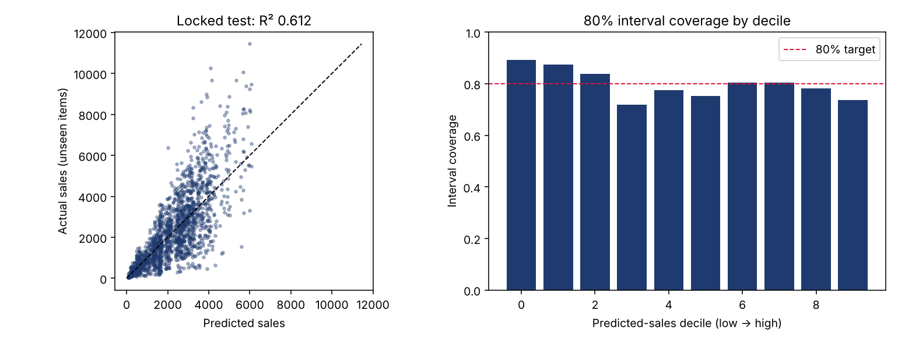
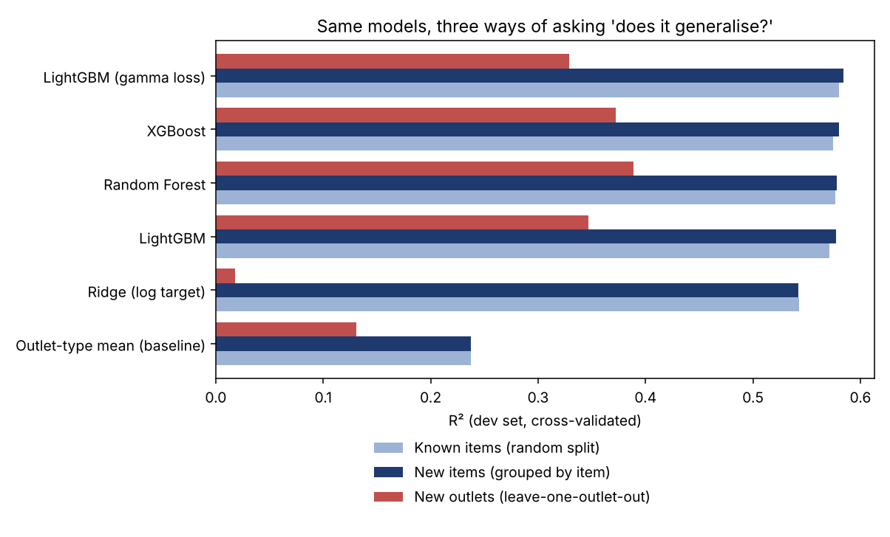

# BigMart Demand Estimation: leakage-safe model, calibrated intervals, REST API

Estimates the yearly sales of a product in a retail outlet, with an **80% prediction interval** and a **per-request explanation**, and serves it through a tested FastAPI service.

The public BigMart dataset has a well-known accuracy ceiling (R² about 0.6). This project does not try to beat that ceiling with tricks. It tries to be **honest about it**: evaluate the way a real deployment would be used, report uncertainty, document what did not work, and ship something that can be called.

> **Data.** Analytics Vidhya / Kaggle "BigMart Sales" training file (8,523 rows: 1,559 products x 10 outlets, one year of sales). It is third-party data and is not redistributed here. Put `Train.csv` in `data/raw/` to reproduce.

## Results (all numbers come from `reports/metrics.json`)

Evaluated once on a **locked test set of 312 products the model never saw** (1,742 rows; no product appears in both dev and test, enforced by an assertion and a test).

| Metric (locked test) | Model | Outlet-type-mean baseline |
| --- | --- | --- |
| R² | **0.612** (95% CI 0.582 to 0.638, cluster bootstrap by product) | 0.239 |
| RMSE | **1131** (95% CI 1062 to 1202) | 1584 |
| MAE | **785** | 1171 |

RMSE is **28.6% lower** than the baseline.

**Prediction intervals (conformalized quantile regression, nominal 80%):** measured coverage on the locked test is **79.8%**. Mean width is 2542 against a mean sale of about 2,180, so the intervals are wide. That is the honest width for data this noisy.

| Coverage by outlet type | Grocery | Type 1 | Type 2 | Type 3 |
| --- | --- | --- | --- | --- |
| Measured (target 80%) | 90% | 78% | 82% | 73% |

Coverage is a marginal guarantee: it holds on average, not for every outlet type. Type 3 is under-covered.



## Three ways of asking "does it generalise?"

A random split lets the same product appear in train and validation (it sells in about 5 outlets). So every model is cross-validated three ways on the dev set (R², higher is better):

| Model | Known items (random) | **New items** (grouped by item) | New outlets (leave-one-outlet-out) |
| --- | --- | --- | --- |
| Outlet-type mean (baseline) | 0.237 | 0.237 | 0.131 |
| Ridge (log target) | 0.543 | 0.542 | 0.018 |
| Random Forest | 0.577 | 0.578 | 0.389 |
| XGBoost | 0.574 | 0.580 | 0.372 |
| LightGBM | 0.571 | 0.577 | 0.347 |
| LightGBM (gamma loss) | 0.580 | 0.584 | 0.329 |



- **LightGBM with a gamma loss** is the best model for new items. Sales are positive and right-skewed, so a log-link loss fits them better than squared error.
- **New outlets are hard** (R² about 0.33). With only 10 outlets the model cannot learn what makes a store good. The API flags such requests and does not claim calibrated intervals for them.
- Tuning with Optuna (40 trials, cold-item CV on dev only) added **+0.013 R²** on fresh CV seeds. Small, and reported as small.

## What I found that I did not expect (read this part)

1. **Price and outlet type explain almost everything.** SHAP shows `Item_MRP` and `Outlet_Type` dominate (`reports/figures/shap_importance.png`). A **two-feature model scores R² 0.588 vs 0.584 for all 11 features** (cold-item CV, default parameters; `scripts/ablation_two_features.py`). The engineered features did not improve accuracy. I kept them because they make the API robust to messy input (imputation and cleaning below), and I say so rather than pretend they help.
2. **A feature I expected to help did not.** An out-of-fold "item demand index" (how well a product sells relative to the outlet average elsewhere) gave R² 0.5907 vs 0.5922 without it. It is implemented, tested for leakage, **off by default**, and reproducible with `scripts/explore_index.py`.
3. **Outlet attributes carry the same information as the outlet ID** (R² 0.592 vs 0.592), so the shipped model uses attributes only. That is what lets the API score a hypothetical new store.

## Data problems found and fixed

| Problem | Count | Fix |
| --- | --- | --- |
| Fat-content label has 5 spellings for 2 values | 545 rows | Normalised; non-consumables (`NC` prefix) become `Non-Edible` |
| Item weight missing | 1,463 rows | Filled from the same product elsewhere (99.7% recoverable), else product-type median |
| Impossible zero visibility | 526 rows | Replaced by the product's (else outlet's) mean visibility |
| Outlet size missing | 2,410 rows | Taken from the outlet; unknown stays `Unknown` rather than being guessed |

All lookups are learned **on training rows only** and re-fitted inside every CV fold.

## API

```bash
pip install -e ".[dev]"
python -m bigmart.train --data data/raw/Train.csv      # about 2.5 minutes; writes models/ and reports/
uvicorn app.main:app --reload                          # docs at http://localhost:8000/docs
```

| Endpoint | Purpose |
| --- | --- |
| `POST /predict` | Estimate + 80% interval + warnings (imputed fields, new outlet, price outside training range) |
| `POST /predict/batch` | Up to 500 rows per call |
| `POST /explain` | Top 5 multiplicative factors behind one estimate (log-link SHAP) |
| `GET /model` | Model card: metrics, known outlets, limitations |
| `GET /stats` | Usage summary read from the SQLite audit log with plain SQL |
| `GET /health` | Liveness + model version |

```bash
curl -s -X POST localhost:8000/predict -H 'content-type: application/json' -d '{"item_identifier":"FDA15","item_type":"Dairy",
  "item_mrp":249.81,"item_weight":9.3,"item_fat_content":"Low Fat","item_visibility":0.016,"outlet_identifier":"OUT049",
  "outlet_establishment_year":1999,"outlet_size":"Medium","outlet_location_type":"Tier 1","outlet_type":"Supermarket Type1"}'
# {"prediction":4099.31,"lower":1703.94,"upper":6404.1,"interval_level":0.8,"outlet_known":true,"warnings":[]}
```

Invalid input (negative price, unknown outlet type, bad item code, over-long batch) returns `422` with the reason.

**Docker:** `docker build -t bigmart-demand . && docker run -p 8000:8000 bigmart-demand`. The image installs runtime dependencies only (no training libraries).

## Testing

`pytest` runs 32 tests in about 4 seconds **without the dataset** (a synthetic stand-in with the same schema): cleaning, imputation, group-split integrity, leakage guards, the API contract, and a guard that the committed `metrics.json` is consistent. The leakage and split tests were **mutation-checked**: re-introducing naive in-sample target encoding, or removing item grouping, makes them fail. A regression test also keeps training-only libraries out of the serving path (that bug was found by serving from a clean virtualenv).

## SQL analytics

`sql/queries.sql` holds six analytical queries (window functions, `ROW_NUMBER`, `NTILE`, cumulative shares) run by `scripts/sql_analytics.py`; results are in `reports/sql_results.md`. Highlights: Supermarket Type 1 carries 69.5% of sales; the top price quartile earns 39.5% of revenue; it takes 901 of 1,559 products (58%) to reach 80% of sales, so the catalogue is not very concentrated.

## Limitations

- **Cross-sectional, one year.** This estimates demand level; it is not a time-series forecast.
- **Ten outlets.** New-outlet estimates are unreliable (see above).
- **Associations, not causes.** Do not read explanation factors as "what happens if I change the price".
- **Intervals are 80% on average**, with uneven coverage by outlet type.

## Layout

```
src/bigmart/   data.py  features.py  models.py  evaluate.py  bundle.py  train.py
app/main.py    FastAPI service (validation, batch, explain, audit log)
tests/         32 tests, no dataset needed
sql/           queries.sql        scripts/  sql_analytics.py  ablation_two_features.py  explore_index.py
reports/       metrics.json  model_comparison.csv  error_by_segment.csv  sql_results.md  figures/
```

MIT licensed.
